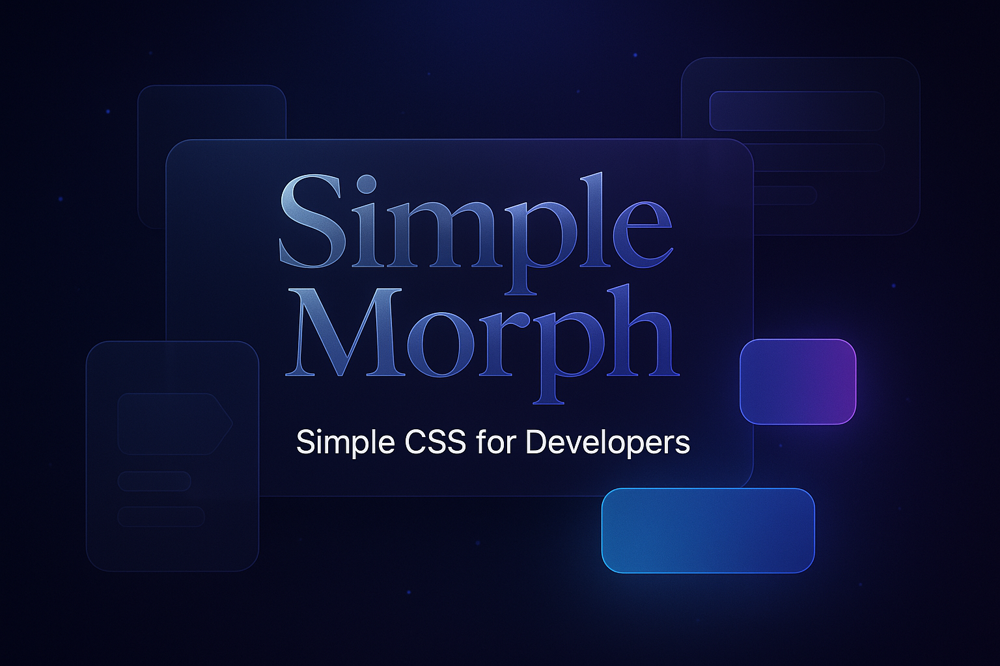

# Simple Morph 🚀

[](https://github.com/davidteren/simple-morph/releases)
[](LICENSE)
[](https://github.com/davidteren/simple-morph)

A modern CSS framework inspired by [Simple.css](https://simplecss.org) with a futuristic dark theme, glassmorphism effects, and semantic HTML-first approach.

> **⚠️ Alpha Version Warning**: This is an alpha release (v0.0.1-alpha). Breaking changes may occur between versions. Use with caution in production environments.

**[🚀 View Live Demo](https://davidteren.github.io/simple-morph/)**



## ✨ Features

- **🎨 Futuristic Dark Theme** - Beautiful dark color palette with gradient accents
- **🔮 Glassmorphism Effects** - Modern glass morphism styling with backdrop blur
- **📱 Mobile Responsive** - Mobile-first design with hamburger menu
- **🏷️ Semantic HTML First** - Style HTML elements directly, minimal classes needed
- **⚡ Smooth Animations** - Subtle animations and hover effects
- **🎯 Accessibility Focused** - WCAG compliant with proper focus states
- **🔧 Customizable** - CSS custom properties for easy theming
- **📦 Lightweight** - Optimized for performance
- **🧭 Navigation Components** - Interactive tabs, breadcrumbs, pagination, dropdowns
- **🪟 Modal Dialogs** - Beautiful overlay modals with backdrop blur and animations
- **🚨 Enhanced Alerts** - Dismissible alerts with icons, animations, and close buttons
- **🎛️ Interactive Elements** - Rich component library with hover effects and transitions

## 🌟 Live Demo

**[View the complete demo with all components →](https://davidteren.github.io/simple-morph/)**

Experience all the features, components, and interactive elements in action. The demo includes:
- Complete component showcase
- Interactive code examples
- Responsive design demonstration
- Glassmorphism effects in action

## 🚀 Quick Start

### CDN (GitHub Pages)
```html
<link rel="stylesheet" href="https://davidteren.github.io/simple-morph/assets/index-BFDMDPNU.css">
<script src="https://davidteren.github.io/simple-morph/simple-morph.js"></script>
```

> **Note:** The CSS filename includes a hash for cache busting. Check the [live demo](https://davidteren.github.io/simple-morph/) source for the current filename.

### Download
1. Download `simple-morph.css` and `simple-morph.js`
2. Include them in your HTML:

```html
<!DOCTYPE html>
<html lang="en">
<head>
    <meta charset="UTF-8">
    <meta name="viewport" content="width=device-width, initial-scale=1.0">
    <title>My Simple Morph Website</title>
    <link rel="stylesheet" href="simple-morph.css">
</head>
<body>
    <!-- Your semantic HTML content -->
    <script src="simple-morph.js"></script>
</body>
</html>
```

## 📖 Usage

### Basic HTML Structure

Simple Morph works with semantic HTML elements out of the box:

```html
<header>
    <h1>Your Website Title</h1>
    <p>A brief description of your site</p>
    <nav>
        <ul>
            <li><a href="#section1">Section 1</a></li>
            <li><a href="#section2">Section 2</a></li>
        </ul>
    </nav>
</header>

<main>
    <section>
        <h2>Section Title</h2>
        <article>
            <h3>Article Title</h3>
            <p>Your content here...</p>
        </article>
    </section>
</main>

<footer>
    <p>&copy; 2024 Your Website</p>
</footer>
```

### Typography

All heading elements are automatically styled with gradient text effects:

```html
<h1>Main Title</h1>
<h2>Section Title</h2>
<h3>Subsection</h3>
<p>Regular paragraph text with <strong>strong</strong> and <em>emphasis</em>.</p>
<blockquote>Beautiful quote with glassmorphism styling</blockquote>
```

### Buttons

```html
<!-- Default button -->
<button>Default Button</button>

<!-- Button variants -->
<button class="button-primary">Primary</button>
<button class="button-secondary">Secondary</button>
<button class="button-success">Success</button>
<button class="button-warning">Warning</button>
<button class="button-error">Error</button>
<button class="button-outline">Outline</button>
```

### Forms

Forms are automatically styled with glassmorphism effects:

```html
<form>
    <label for="name">Name</label>
    <input type="text" id="name" placeholder="Enter your name">
    
    <label for="email">Email</label>
    <input type="email" id="email" placeholder="your@email.com">
    
    <label for="message">Message</label>
    <textarea id="message" rows="4" placeholder="Your message..."></textarea>
    
    <button type="submit" class="button-primary">Send</button>
</form>
```

### Components

#### Cards
```html
<div class="card">
    <h3>Card Title</h3>
    <p>Card content with glassmorphism styling</p>
</div>

<!-- Interactive cards -->
<div class="card hover-glow">Hover for glow effect</div>
<div class="card shimmer">Shimmer animation</div>
```

#### Alerts
```html
<div class="alert alert-success">Success message</div>
<div class="alert alert-warning">Warning message</div>
<div class="alert alert-error">Error message</div>
<div class="alert alert-info">Info message</div>
```

#### Progress Bars
```html
<div class="progress">
    <div class="progress-bar" data-progress="75"></div>
</div>

<!-- Colored variants -->
<div class="progress">
    <div class="progress-bar progress-bar-success" data-progress="100"></div>
</div>
```

#### Badges
```html
<span class="badge badge-primary">Primary</span>
<span class="badge badge-success">Success</span>
<span class="badge badge-warning">Warning</span>
```

### Mobile Navigation

Add mobile menu support:

```html
<header>
    <nav>
        <ul>
            <li><a href="#home">Home</a></li>
            <li><a href="#about">About</a></li>
        </ul>
        
        <!-- Mobile menu toggle -->
        <button class="mobile-menu-toggle" aria-label="Toggle menu">
            <svg width="24" height="24" viewBox="0 0 24 24" fill="none" stroke="currentColor">
                <line x1="3" y1="6" x2="21" y2="6"></line>
                <line x1="3" y1="12" x2="21" y2="12"></line>
                <line x1="3" y1="18" x2="21" y2="18"></line>
            </svg>
        </button>
    </nav>
</header>

<!-- Mobile menu -->
<div class="mobile-menu">
    <nav>
        <a href="#home">Home</a>
        <a href="#about">About</a>
    </nav>
</div>
```

### New Interactive Components

#### Navigation Tabs
```html
<div class="tabs">
    <div class="tab-buttons">
        <button class="tab-button active" data-tab="tab1">Tab 1</button>
        <button class="tab-button" data-tab="tab2">Tab 2</button>
    </div>
    <div class="tab-content active" data-tab-content="tab1">
        <p>Content for tab 1</p>
    </div>
    <div class="tab-content" data-tab-content="tab2">
        <p>Content for tab 2</p>
    </div>
</div>
```

#### Breadcrumbs
```html
<nav class="breadcrumb">
    <ol>
        <li><a href="#home">Home</a></li>
        <li class="separator">→</li>
        <li class="current">Current Page</li>
    </ol>
</nav>
```

#### Pagination
```html
<nav class="pagination">
    <ul class="pagination-list">
        <li><button data-pagination="prev">‹</button></li>
        <li><button data-page="1" class="active">1</button></li>
        <li><button data-page="2">2</button></li>
        <li><button data-pagination="next">›</button></li>
    </ul>
</nav>
```

#### Modal Dialogs
```html
<!-- Trigger -->
<button data-modal-target="#my-modal">Open Modal</button>

<!-- Modal -->
<div id="my-modal" class="modal">
    <div class="modal-content">
        <div class="modal-header">
            <h3 class="modal-title">Modal Title</h3>
            <button class="modal-close">&times;</button>
        </div>
        <div class="modal-body">
            <p>Modal content goes here</p>
        </div>
        <div class="modal-footer">
            <button data-modal-close>Close</button>
        </div>
    </div>
</div>
```

#### Enhanced Alerts
```html
<div class="alert alert-success">
    <div class="alert-icon">✓</div>
    <div class="alert-content">
        <strong>Success!</strong> Your action was completed.
    </div>
    <button class="alert-close">&times;</button>
</div>
```

## 🎨 Customization

### CSS Custom Properties

Customize the framework by overriding CSS custom properties:

```css
:root {
    /* Colors */
    --accent-primary: #00ff88;
    --accent-secondary: #ff0088;
    
    /* Glass effects */
    --glass-bg: rgba(255, 255, 255, 0.1);
    --glass-border: rgba(255, 255, 255, 0.2);
    
    /* Typography */
    --font-family: 'Your Font', sans-serif;
    
    /* Spacing */
    --spacing-md: 1.5rem;
    --border-radius: 16px;
}
```

### Utility Classes

#### Glass Morphism
```html
<div class="glass">Standard glass effect</div>
<div class="glass-strong">Enhanced glass effect</div>
```

#### Interactive Effects
```html
<div class="hover-glow">Hover glow effect</div>
<div class="shimmer">Shimmer animation</div>
```

## 🔧 JavaScript Features

The framework includes JavaScript for enhanced functionality:

- **Mobile Menu** - Automatic hamburger menu for mobile devices
- **Smooth Scrolling** - Smooth scroll for anchor links
- **Animations** - Scroll-triggered fade-in animations
- **Interactive Components** - Dropdowns, tabs, tooltips
- **Progress Bars** - Animated progress bars
- **Background Effects** - Floating orbs and parallax effects

### JavaScript API

```javascript
// Access the framework instance
window.SimpleMorph

// Utility functions
SimpleMorph.utils.debounce(func, delay)
SimpleMorph.utils.isInViewport(element)
```

## 📱 Browser Support

- Chrome 60+
- Firefox 55+
- Safari 12+
- Edge 79+

*Note: Glassmorphism effects require modern browsers with backdrop-filter support*

## 📋 Versioning & Changelog

This project follows [Semantic Versioning](https://semver.org/).

- **Current Version**: 0.0.1-alpha
- **Release Date**: January 11, 2025
- **Status**: Alpha (breaking changes may occur)
- **Changelog**: See [CHANGELOG.md](CHANGELOG.md) for detailed release notes
- **Releases**: View all releases on [GitHub](https://github.com/davidteren/simple-morph/releases)

> **⚠️ Alpha Release**: This is an alpha version. APIs and features may change without notice. Not recommended for production use.

### Version History
- **v0.0.1-alpha** (2025-01-11): Initial alpha release with complete component library and desktop layout fixes

## 🤝 Contributing

Contributions are welcome! Please feel free to submit a Pull Request.

1. Fork the repository
2. Create your feature branch (`git checkout -b feature/amazing-feature`)
3. Commit your changes (`git commit -m 'Add some amazing feature'`)
4. Push to the branch (`git push origin feature/amazing-feature`)
5. Open a Pull Request

## 📄 License

MIT License - feel free to use in personal and commercial projects.

## 🙏 Acknowledgments

- Inspired by [Simple.css](https://simplecss.org) philosophy
- Glassmorphism design trends
- Modern web design principles

---

**Built with ❤️ for the future of web design**
